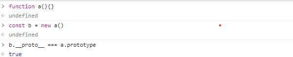
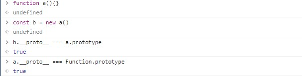
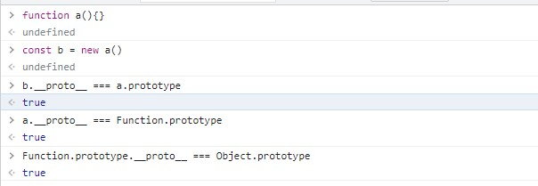
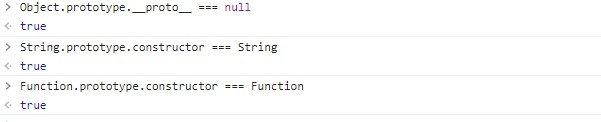

## 原型链
 #### `__proto__和prototype`
__proto__指向当前对象的原型，prototype是函数才具有的属性，默认情况下，new 一个函数创建出的对象，其原型都指向这个函数的prototype属性。
一般只有内置的构造函数才拥有prototype属性 ， 代表当前的对象的作用域 ， 在new 初始化创造出来的时候 , 如下图

```
b.__proto__ 指向了 a.prototype (a的原型链) , 而且此时的b是没有prototype属性的 ， 因为它是一个实列。
a因为是一个函数 ，所以a.__proto 指向的应该是Function的原型链
```

但是呢 Function.prototype其实是一个Object , 所以 

然而`Object.prototype.__proto__ === null`
构造函数原型链中的构造函数等于自身


### 用途
其实原型链的设计 ， 因为在js中没有面向对象的概念 ， 它可以在一定的程度上进行面向对象中继承 ， 多态的概念。以及在es6中的语法糖class ， 其实在内部也是基于js的原型链来进行的。
通过babel编译es6中的class代码进行查看[babel编译](https://segmentfault.com/a/1190000038331178)
这是es6中的代码
```
class People {
    constructor(){
        console.log('constructor')
    }

    talk(){
        console.log('I am a people')
    }
}
```
通过babel编译得到的代码
```
"use strict";

function _classCallCheck(instance, Constructor) { if (!(instance instanceof Constructor)) { throw new TypeError("Cannot call a class as a function"); } }

function _defineProperties(target, props) { for (var i = 0; i < props.length; i++) { var descriptor = props[i]; descriptor.enumerable = descriptor.enumerable || false; descriptor.configurable = true; if ("value" in descriptor) descriptor.writable = true; Object.defineProperty(target, descriptor.key, descriptor); } }

function _createClass(Constructor, protoProps, staticProps) { if (protoProps) _defineProperties(Constructor.prototype, protoProps); if (staticProps) _defineProperties(Constructor, staticProps); Object.defineProperty(Constructor, "prototype", { writable: false }); return Constructor; }

var People = /*#__PURE__*/function () {
  function People() {
    _classCallCheck(this, People);

    console.log('constructor');
  }

  _createClass(People, [{
    key: "talk",
    value: function talk() {
      console.log('I am a people');
    }
  }]);

  return People;
}();
```
通过Object.defineProperty在函数People的原型链上进行属性的定义。